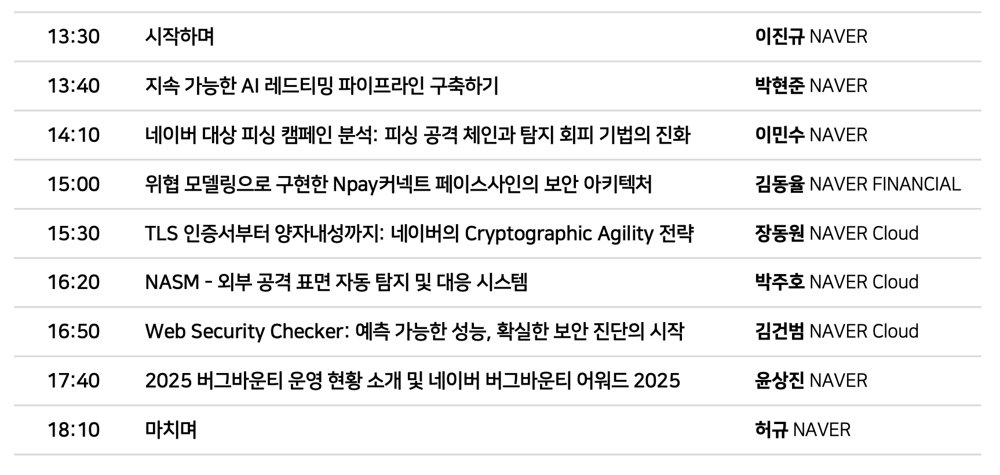

4월 30일에 진행한 NAVER SECURITY SEMINAR에 대한 후기입니다.
사전 예약으로 예약자들 한에서 입장할 수 있었습니다.

입구에서 나눠주는 가방이 있었는데, 까만색과 녹색 중에 랜덤으로 나눠주시더라고요.
안에는 네이버 굿즈나 쿠키, 물이랑 음료수 등이 있었습니다.

발표 구성은 아래와 같습니다.

다양한 발표가 있었고, 제가 인상깊게 보았던 3가지만 추려 소개하겠습니다.

### 1. 지속 가능한 AI 레드티밍 파이프라인 구축하기

발표의 첫번째 순서에 있는 만큼 가장 집중이 잘될 때 진행된 발표라 그런지 기억에 남았습니다. 발표 내용을 듣기 전 네이버의 AI 레드팀에서 어떤 활동을 하는지 알아봅시다.

- AI 레드팀
: 네이버의 AI레드팀에서는 AI 시스템의 안전 경계를 체계적으로 탐색하고 방어가 실패하는 조건과 패턴을 발견하고 구체적인 재선 방향을 제시하는 보안 평가활동을 한다고 합니다.

안전 경계를 탐색할 때는 크게 두가지 기준으로 측정하는데, Safety와 Jailbreak 저항성입니다.
- LLM Safety 측정과 Jailbreak 저항성 측정
: Safety는 모델이 유해한 질문을 거부할 수 있는가?를 측정하고, Jailbreak 저항성은 공격자가 의도적으로 우회 시도를 할 때 모델이 버틸 수 있는지를 측정합니다.
이 둘 사이의 갭을 Reslience Gap이라고 하는데, 이 갭의 차이에 따라 해석이 달라집니다.

- ASR(Attack Success Rate)이란?
: Jailbreak 공격이 성공한 비율을 나타낸는 핵심 지표를 말합니다.
하지만 ASR의 결과는 왜곡될 수 있는데, 아래와 같은 이유로 이루어집니다.

- 서로 다른 측정기준
: 어떤 것은 유해 프롬프트 당 한 번의 공격으로 유해 답변이 나올수도 있고, 어떤 것은 400번의 디도 하고 그 중 한 번이라도 유해하다면 공격 성공으로 카운팅하게 되는 문제가 발생하여 이를 완전히 신뢰하기 어려워집니다.

- 느슨한 LLM Judge와 잘못된 해석
: Judge가 느슨한 탓에 모델이 거부하지 않았다는 사실만으로 "성공"이라 판단하거나 원래 공격 의도에 맞는 답변이 없음에도 "성공"이라고 표기하게 되는 문제점이 생길 수 있습니다.

- 잘못된 harmful 라벨
: 이로 인해 모델이 뚫린 것이 아닌데도 정상적인 질문에 정상적인 답변을 하였는데도 라벨링이 잘못되어 공격 성공으로 카운트하는 경우가 생겨 문제가 일어납니다.

이러한 점들을 주의하며 ASR을 바라보아야합니다.

본격적으로 AI레드팀의 구성 및 역할에 대해서도 알아봅시다.
- Safety와 Red Team
: Safety는 답변이 안전 가이드라인이 위반이 되는지를 보고, 레드팀에서는 시스템의 논리적 허점이 어디인지 찾습니다. 이 두 팀이 각자의 전문성을 발휘하며 협력하는 구조를 이루는 것이 중요합니다.

프레임워크를 구축할 때는 안전한 모델을 선정하고 Agentic 앱의 보안을 검증합니다. 그 후에 외부 레드팀과의 협업을 통해 외부 테스트 결과를 내부 프레임워크에 정규화하는 과정을 거칩니다.

프레임워크를 설계할 때는 아래와 같은 기준으로 합니다.
- P1. Failure Machanism based Taxonomy
: 15개 Family가 모델/시스템의 어떤 속성이 실패했는지를 기준으로 정의합니다.

- P2. Three-way Separation
: Three-way는 무엇이 깨지는가, 어떻게 만드는가, 기술을 얘기합니다.

- P3.

정리하면 AI 레드티밍은 해킹 역량뿐만 아니라 정교화된 측정 역량이 요구된다고 합니다.
기업을 통한 AI 레드티밍을 준비한다면 시스템을 뚫는 것보단 약한 고리를 측정할 수 있어야하고 정확한 측정을 위해 정교한 레드팀 파이프라인 구축이 반드시 필요함을 알 수 있었습니다. 새로운 공격과 기술은 에이전트를 통해 자동화를 구축하고 업데이트하는 방식으로 나아가겠다며 발표를 마무리하셨습니다.

### 2. 네이버 대상 피싱 캠페인 분석: 피싱 공격 체인과 탐지 회피 기법의 진화

이 주제에 관련해서 예전에 기사를 읽은 적이 있어 발표전에도 가장 관심이 갔던 주제였습니다.

###### 1. 피싱 유포 방식의 다중화
네이버에서 수집한 피싱 모델에서 확보한 피싱 URL 분석 결과 스팸메일에서 소셜미디어, 검색엔진, 검색 광고 순으로 공격채널이 다변화 있다고 합니다.
순서대로 알아보자면
- 메일 서비스 악용 피싱 유포
: 예전에는 공공기관을 사칭하여 전자 문서 서비스 메일 형태로 위장한 채로 피싱 채널을 유포했다고 합니다. 요즘에는 계정 보안 위협을 사칭하여 새로운 등록을 요청하고 해외 IP로 로그인되었다든지 택배나 물류 정보 안내 및 웹 메일 오류 안내등으로 다양화되고 있습니다.

- 소셜 미디어 기반 피싱
: 지인을 사칭한 DM으로 피싱 링크를 공유하고 미리보기 이미지를 통해 피싱 링크를 네이버 카페와 같은 사이트로 위장하여 클릭 유도를 하는 방식입니다.

- 검색 엔진 기반 피싱
: 검색 엔진을 통해서 접근할 때 피싱 페이지를 노출하는 유형입니다.
  주로 광고 페이지를 
  네이버의 사례로는 간편 로그인 연도 제휴사 사이트를 해킹하여 로그인 버튼 링크를 피싱 링크로 변조하여 이용자가 정상 로그인을 시도하는 과정에서 계정 정보를 탈취한 사례가 있었다고 합니다. 이 때 수집된 계정정보에 네이버페이 결제 비밀번호가 있어 큰 피해가 있었습니다.

###### 2. 탐지 회피 기법
- 메일 서비스 피싱 차단 우회 방식
: 피싱에 사용되는 도메인을 빠르게 생성하고 소비하는 패턴으로 우회를 시도합니다. 이때 URL을 메일 본문에서 은닉해 스팸 필터를 우회하고, 탈취 정보는 외부 서비스로 전달하여 피싱 서버 노출을 최소화합니다.

- 검색 엔진 기반 피싱 차단 우회 방식
: 보안 시스템의 자동화 접근을 식별하여 크롤러에게는 정상 페이지를 반환하고 실 이용자에게만 피싱을 노출하는 전략입니다.

- 광고주 센터 계정 악용 피싱 차단 우회 방식
: 보안 시스템의 자동화 접근을 고도화 된 방법으로 식별하여, 실 이용자에게만 피싱을 노출하는 전략입니다. 이러한 우회를 피하기 위해 보안 분석 도구 및 자동화 환경에 특화된 다층적 필터링을 적용하여 방어합니다.

###### 3. 능동적 방어 체계로의 전환
- 블랙리스트 기반 차단 방식
: 블랙리스트 기반 차단은 확인된 위협을 즉시 차단하는 신뢰성을 갖추고 있으나, 피싱 URL의 빠른 교체 주기로 인해 탐지

### 3. Web Security Checker: 예측 가능한 성능, 확실한 보안 진단의 시작

### 4. 전체적인 후기
네이버의 기술 현황을 알아볼 수 있어 재밌었습니다.